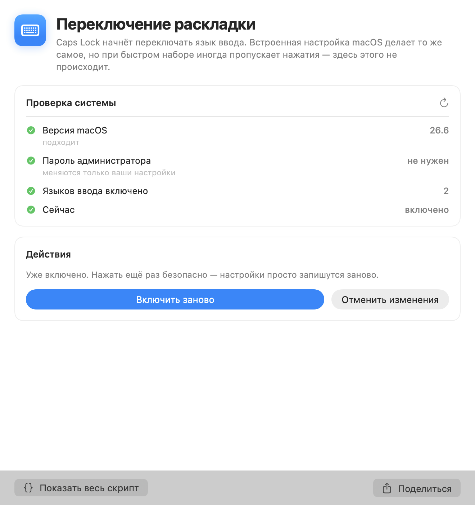
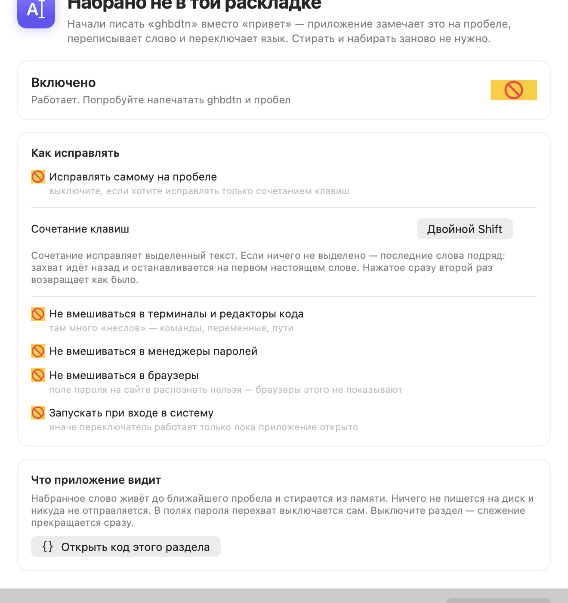
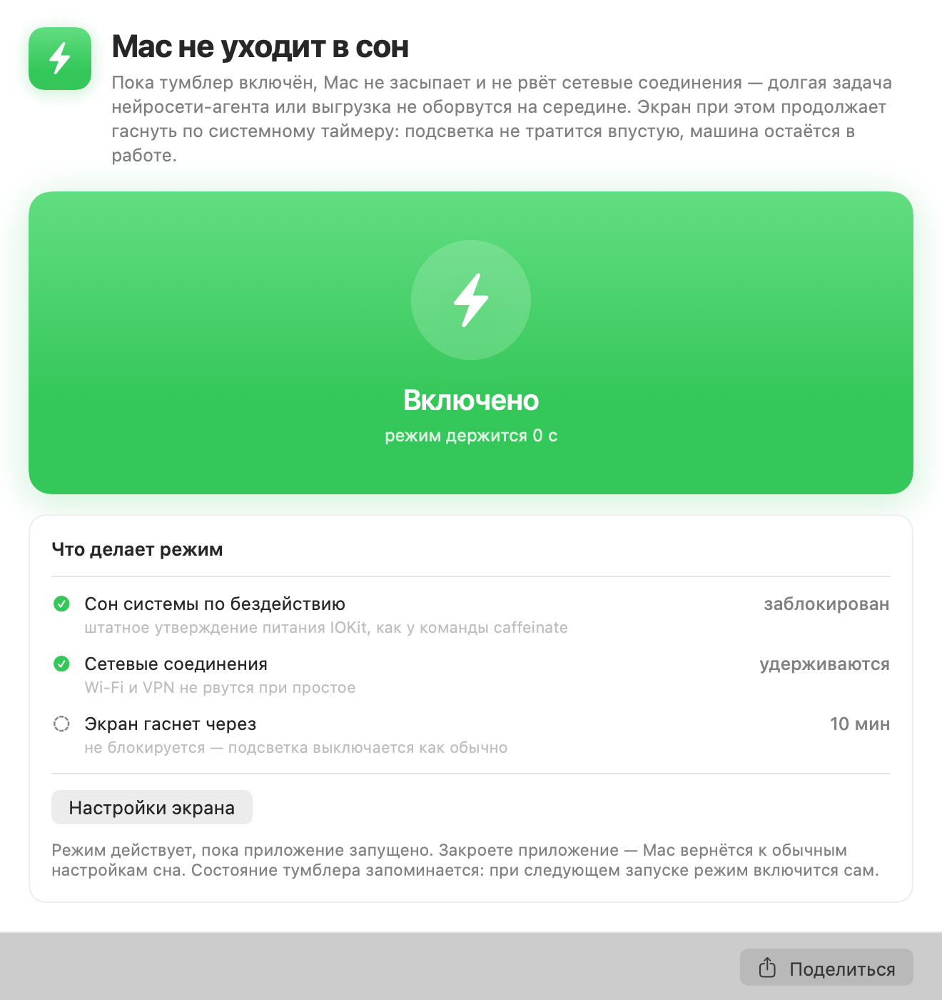
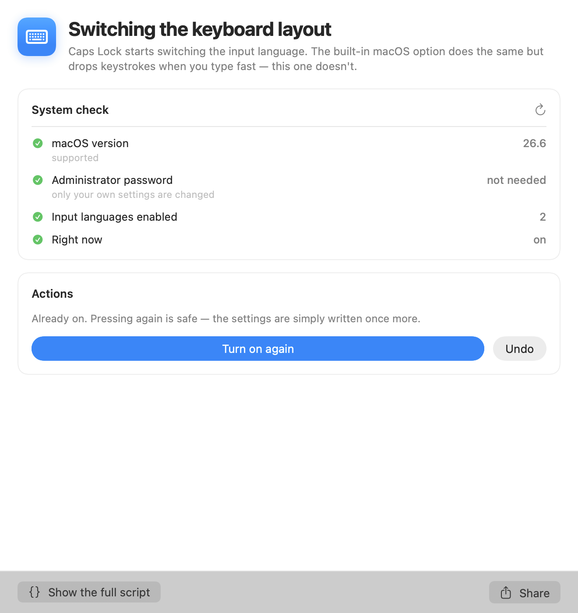

# MacOS Utilities

Четыре утилиты для macOS в одном окне: надёжное переключение раскладки
по Caps Lock, исправление текста, набранного не в той раскладке, снятие
зависшего AirDrop и режим «не давать Mac уснуть».

<p>


</p>
<p>


</p>

Интерфейс на русском и английском, переключается внизу боковой панели.
При первом запуске берётся язык системы.

Приложение ничего не прячет. Каждый фикс — обычный bash-скрипт с подробными
комментариями, который лежит внутри бандла; кнопка **«Показать весь скрипт»**
открывает ровно тот код, который будет выполнен. Права администратора нужны
ровно в одном месте, и об этом сказано прямо в интерфейсе.

Приложение живёт значком в строке меню. Закрытое окно убирает значок из Dock,
но само приложение продолжает работать: автопереключение и режим «не спать»
не должны выключаться от того, что окно закрыли. Вернуть окно — пункт
«Открыть окно…» в меню значка, выйти совсем — «Выйти» там же.

## Установка

Скачать `MacOS-Utilities-1.5.0.dmg` из [Releases](https://github.com/sipandk-art/macos-utilities/releases),
открыть, перетащить **MacOS Utilities** в **Applications**.

macOS 13 (Ventura) и новее, Apple Silicon и Intel.

## Переключение раскладки

Штатная галка «Использовать Caps Lock для переключения раскладки» работает через
обработчик, который при быстром наборе теряет нажатия: печатаешь быстро — раскладка
не переключилась, половина слова ушла не в тот язык.

Фикс обходит этот путь целиком:

| Шаг | Что делается | Где живёт |
| --- | --- | --- |
| 1 | Caps Lock перекладывается на F18 в HID-слое | `hidutil property --set UserKeyMapping` |
| 2 | Ремап повторяется при каждом входе в систему | `~/Library/LaunchAgents/com.user.capslock2f18.plist` |
| 3 | На F18 вешается шорткат «предыдущий источник ввода» | `com.apple.symbolichotkeys`, ключ `60` |
| 4 | Если Caps Lock стоял в «Нет действия» — возвращается на место | `com.apple.keyboard.modifiermapping.*` |

Перед применением приложение проверяет версию macOS, число включённых раскладок
(меньше двух — переключать нечего) и хвосты от Karabiner-Elements.

**Отмена.** Первое включение сохраняет прежнее состояние в
`~/Library/Application Support/MacOS Utilities/input-source-backup.json`. Кнопка
«Отменить изменения» возвращает системный шорткат к прежнему значению, снимает
ремап и убирает LaunchAgent.

Права администратора не нужны: всё перечисленное — настройки текущего пользователя.

## Набрано не в той раскладке

Начали писать «ghbdtn» вместо «привет» — приложение замечает это на пробеле,
переписывает слово и переключает язык. То же самое делал Punto Switcher,
Mac-версию которого забросили в 2017 году.

Как принимается решение:

1. Нажатия копятся до границы слова — запоминаются коды клавиш, не символы.
2. На пробеле слово собирается дважды: в текущей раскладке и в другой.
   Соответствие клавиш символам берётся у самой системы (`UCKeyTranslate`),
   поэтому работает любая пара раскладок, а не только зашитая в код.
3. Каждый вариант проверяется по словарю macOS (`NSSpellChecker`) — своих
   словарей приложение не носит.
4. Переписывается только если набранное словом не является, а вариант
   в другой раскладке — является. Оба верны или оба неверны — не трогаем.

Здесь есть ловушка, из-за которой наивная проверка портит текст: английский
словарь macOS считает **любую** кириллицу правильным словом — он просто
пропускает чужую письменность мимо. Поэтому язык проверки выбирается
по письменности самого слова, а не по раскладке.

Не трогаются слова короче трёх букв, ВЕРХНИЙ РЕГИСТР, camelCase, всё
с цифрами и знаками путей, а также ввод с зажатыми Cmd, Ctrl и Opt.

Порог именно три буквы, а не две: на трёх ложных срабатываний не нашлось
вовсе — «црн» становится «why», а `png`, `sql`, «как» и `the` остаются как
есть. На двух они появляются: `ns` превратилось бы в «ты».

**Где не вмешивается.** По умолчанию — терминалы и редакторы кода, менеджеры
паролей и любое системное поле пароля. Отдельной галкой можно отключить и все
браузеры: поле пароля на веб-странице распознать нельзя, и это не наше
упущение — ни Safari, ни Chrome не включают для него системный «защищённый
ввод» и не показывают такие поля системе доступности. Проверено на обоих:
настоящее системное поле пароля определяется, а веб-поле — нет.

**Горячее сочетание** (по умолчанию двойной Shift) исправляет последнее слово.
Выделите текст — исправит всё выделенное, сколько бы там ни было слов; границы
задаёте вы, а не догадка программы. Нажатое сразу второй раз возвращает как было.

Выделение читается напрямую у программы через систему доступности. Приложения
на Electron — мессенджеры, редакторы, клиенты нейросетей — выделение так не
отдают, поэтому для них есть запасной путь: приложение просит скопировать
выделение и сразу возвращает буфер обмена в прежнее состояние, вместе со всеми
типами данных, а не только текстом.

Автоматику можно выключить и пользоваться только сочетанием: нажатия копятся
в любом случае.

**Разрешения.** Это единственный раздел, которому нужны разрешения macOS:
универсальный доступ, чтобы стирать и печатать, и мониторинг ввода, чтобы видеть
нажатия. Они запрашиваются только при включении раздела. Набранное слово живёт
до ближайшего пробела и стирается из памяти: ничего не пишется на диск и никуда
не отправляется. В полях пароля перехват выключается сам, терминалы, редакторы
кода и менеджеры паролей пропускаются по умолчанию.

## Зависший AirDrop

Окно «Поделиться → AirDrop» рисует не Finder, а два его расширения:
`ShareSheetUI.appex` и `AirDrop.appex`. Бывает, что окно закрыли, а расширения
не вышли — процессы висят в системе неделями, держат отправляемый файл
отображённым в память и время от времени всплывают поверх других окон.

Раздел находит такие процессы по пути к бандлу расширения, показывает возраст
каждого и какой файл в нём застрял, снимает старые (`kill`, через две секунды
выжившим `kill -9`) и перезапускает `sharingd` — демон, который и есть служба
AirDrop; launchd поднимает его обратно сам.

Так выглядит поиск:

```
== Окна AirDrop (зависшим считается то, что живёт дольше 5 мин) ==
  95340   15d21h   AirDrop        ЗАВИСЛО
          • застрял файл: /Users/you/Downloads/photos/IMG_4557.jpg
  95326   15d21h   ShareSheetUI   ЗАВИСЛО
  38712   14s      AirDrop        норма
```

Параметры:

- **перезапустить Finder** — если окно AirDrop нарисовано, но не откликается.
  Перед запуском приложение предупреждает, что окна Finder закроются
  и рабочий стол перерисуется;
- **перезапустить Wi-Fi для AirDrop** — лечит «Mac не видит iPhone».
  Единственное место, где нужен пароль администратора — его спрашивает
  системное окно, не терминал.

Зависшим считается окно, которое живёт дольше пяти минут: столько открытый
шит AirDrop не живёт, а свежий случайно не закроется.

## Mac не уходит в сон

Одна большая кнопка. Во включённом состоянии Mac не засыпает по бездействию
и не рвёт сетевые соединения — долгая задача нейросети-агента или выгрузка
не оборвутся на середине.

Механизм — штатные power assertions IOKit, то же самое, что делает системная
утилита `caffeinate`: `PreventUserIdleSystemSleep` и `NetworkClientActive`.
Утверждение на дисплей сознательно не берётся, поэтому экран продолжает гаснуть
по системному таймеру — подсветка не тратится впустую, машина остаётся в работе.

Режим действует, пока приложение запущено. Состояние кнопки запоминается:
при следующем запуске режим включится сам.

## Чего приложение не делает

- Не отправляет никуда данные и не ходит в сеть.
- Не ставит фоновых агентов от своего имени. Единственный LaunchAgent —
  `com.user.capslock2f18` — появляется только по кнопке «Включить» в первом
  разделе и удаляется по кнопке «Отменить изменения».
- Не требует прав администратора нигде, кроме опции «Перезапустить Wi-Fi для AirDrop».
- Не просит разрешений macOS, пока не включено автопереключение раскладки, —
  и перестаёт следить за клавиатурой сразу, как только его выключить.

## Сборка из исходников

```bash
git clone https://github.com/sipandk-art/macos-utilities.git
cd macos-utilities
./scripts/build-app.sh --dmg
```

Нужен Xcode или Command Line Tools со Swift 5.9+. Результат —
`build/MacOS Utilities.app` и `dist/MacOS-Utilities-1.5.0.dmg`.

Скрипты работают и сами по себе, без приложения:

```bash
./Resources/Scripts/input-source-fix.sh check
./Resources/Scripts/airdrop-fix.sh list
./Resources/Scripts/airdrop-fix.sh selftest

# логика автопереключения: перевод нажатий, словарь, таблица символов
"./build/MacOS Utilities.app/Contents/MacOS/MacOSUtilities" --selftest

# на английском
./Resources/Scripts/airdrop-fix.sh check --lang en
```

Устройство проекта, подпись и выпуск релиза — в [docs/DEVELOPMENT.md](docs/DEVELOPMENT.md).

## Лицензия

MIT — см. [LICENSE](LICENSE).

---

**English summary.** MacOS Utilities bundles four macOS fixes in one window:
a reliable Caps Lock → input-source switcher (HID remap to F18 plus a system
shortcut, surviving reboots), a Punto-Switcher-style fixer for text typed in the
wrong layout (keystrokes are re-rendered through both layouts and checked against
the macOS dictionary), a cleaner for stuck AirDrop share-sheet helper processes
with a `sharingd` restart, and a keep-awake toggle built on IOKit power
assertions that lets the display sleep while the system stays up. Every fix is a
commented bash script shipped inside the bundle and viewable from the UI before
you run it. No admin password is required except for the optional Wi-Fi restart.

The interface and the script output are available in English — switch at the
bottom of the sidebar; the app picks your system language on first launch.
